# TaskFlow

A task and project management web application built with Flask and MySQL, containerized with Docker, deployed on AWS EC2, and delivered through a six-stage Jenkins CI/CD pipeline with automated testing.

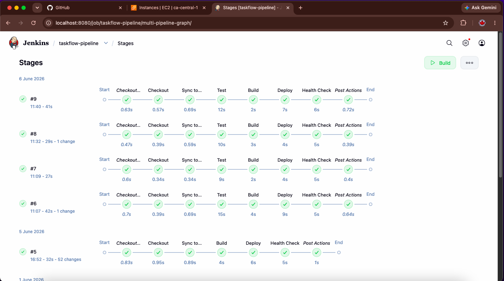

*Multiple builds of the CI/CD pipeline, all six stages green, executed across multiple days.*

## What This Project Demonstrates

This is a DevOps portfolio project. The focus is on the deployment lifecycle around a web application rather than on the application's product features.

- **Containerization** - Multi-container application orchestrated with Docker Compose
- **CI/CD** - Six-stage Jenkins pipeline: Checkout → Sync → Test → Build → Deploy → Health Check
- **Automated testing** - 40 pytest tests gating every deployment
- **Cloud deployment** - AWS EC2 with security group network isolation
- **Custom images** - A purpose-built Jenkins Docker image for reproducible CI
- **Infrastructure debugging** - Real problems solved: Docker socket permissions, container networking, SSH tunneling, git history correction

## Tech Stack

| Layer | Technology |
|-------|------------|
| Application | Flask 3.0, Python 3.11, Gunicorn |
| Database | MySQL 8.0 |
| Containers | Docker, Docker Compose |
| CI/CD | Jenkins (custom image with Docker CLI baked in) |
| Testing | pytest |
| Cloud | AWS EC2 (t2.micro, Ubuntu 24.04, ca-central-1) |
| Frontend | HTML/CSS (no JS framework - kept minimal) |

## CI/CD Pipeline

The Jenkins pipeline runs six stages on every push to `main`. A failure at any stage stops the pipeline and prevents the broken code from being deployed.

### All 40 tests passing inside the pipeline

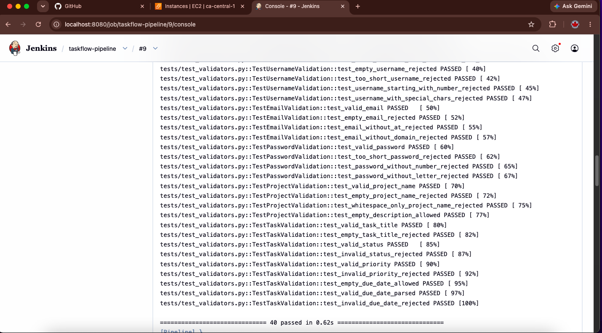

### Pipeline auto-triggered by a git push (not manual)

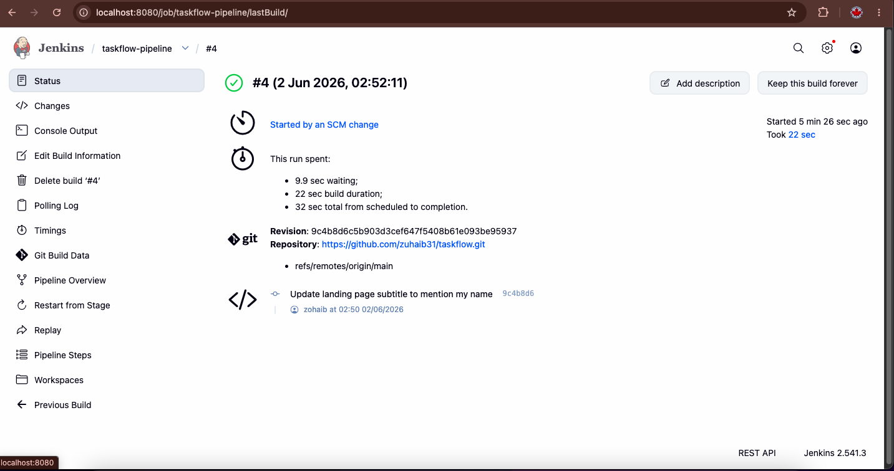

### Successful end-to-end deployment

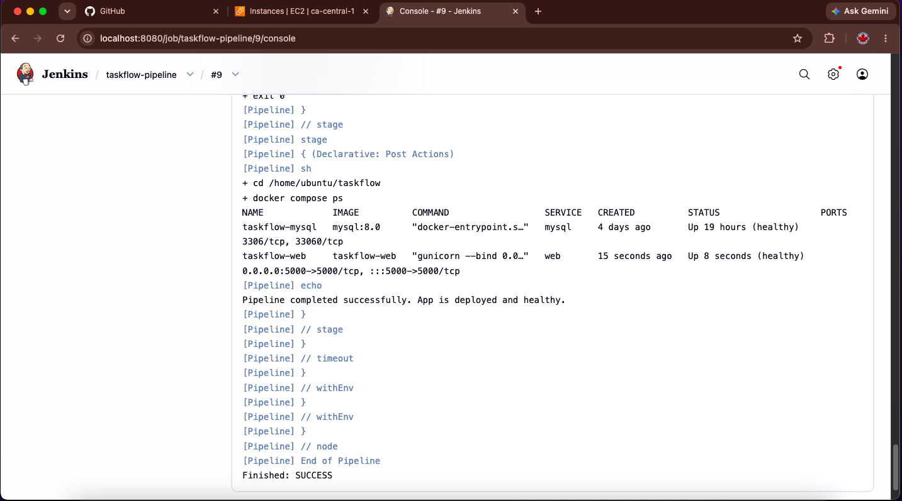

For full pipeline-as-code, see [`Jenkinsfile`](Jenkinsfile).

## Application

A working task and project management tool with user authentication, projects, tasks, priorities, due dates, and a kanban board.

### Landing page

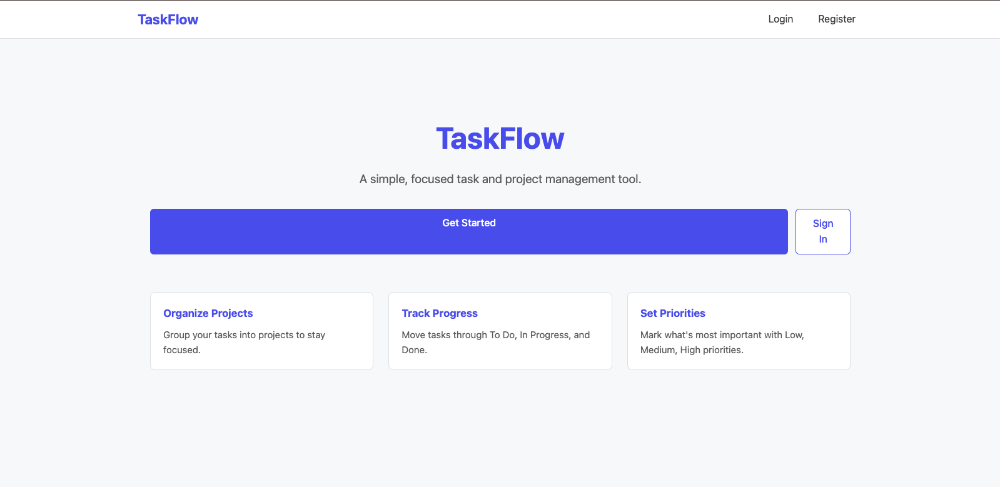

### Dashboard with real data

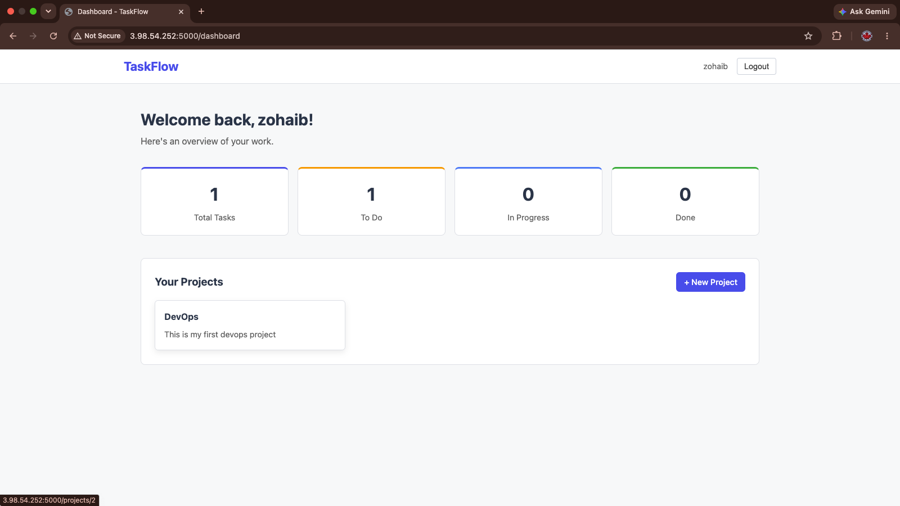

### Kanban board with multiple tasks across statuses

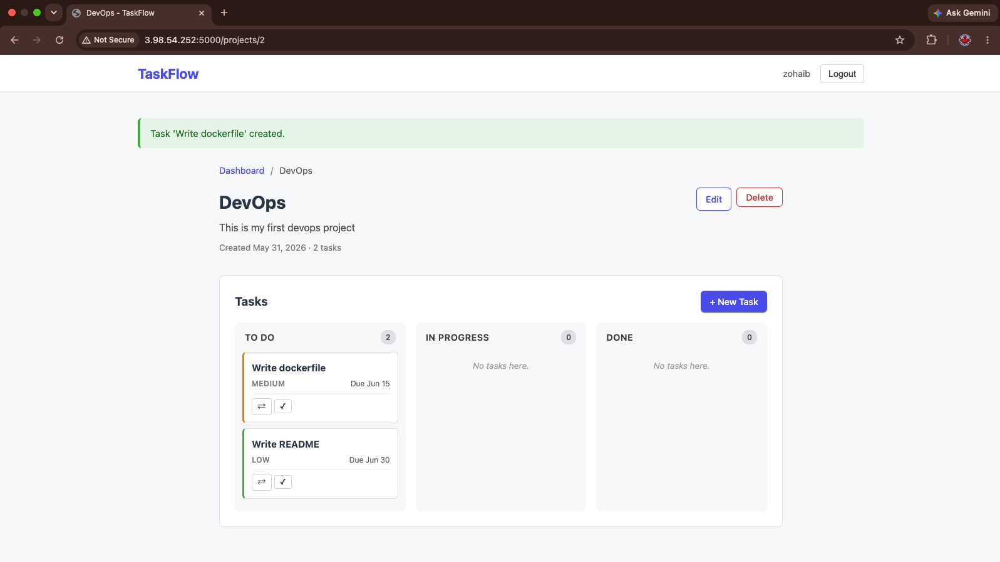

### Status changes via quick action buttons

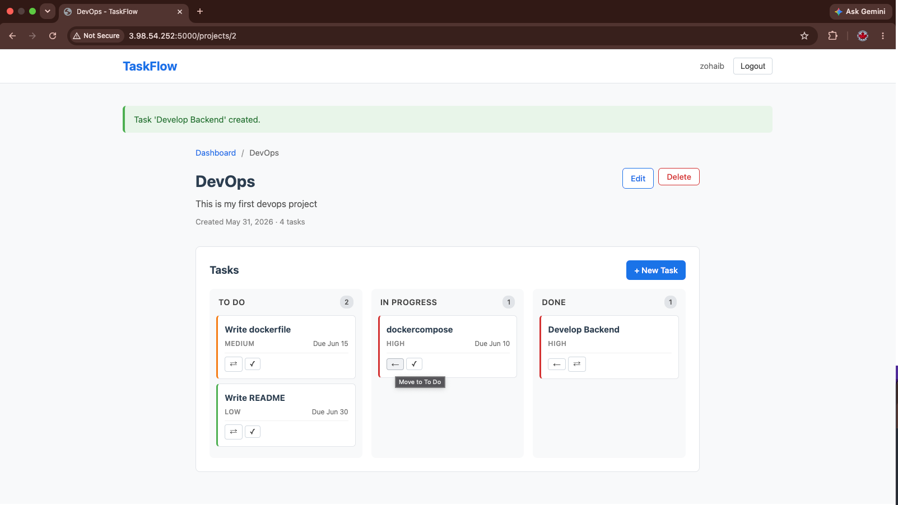

### Dashboard summary with task statistics

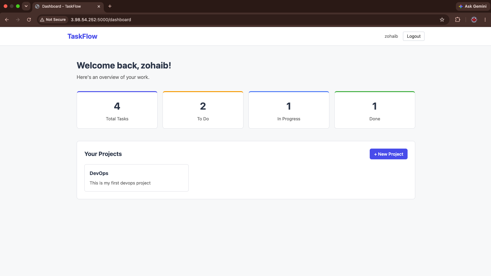

## Infrastructure

### AWS EC2 instance running the application

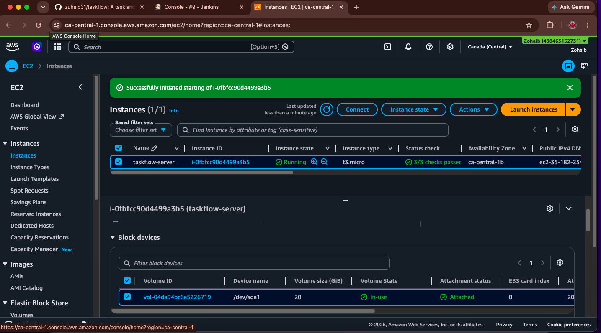

### Security group network rules

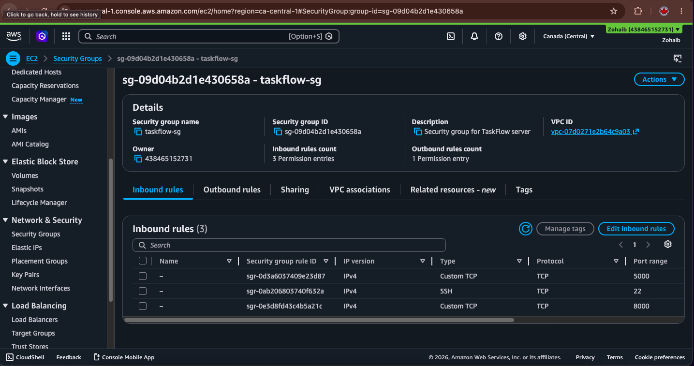

## Jenkins

### Dashboard with the pipeline job

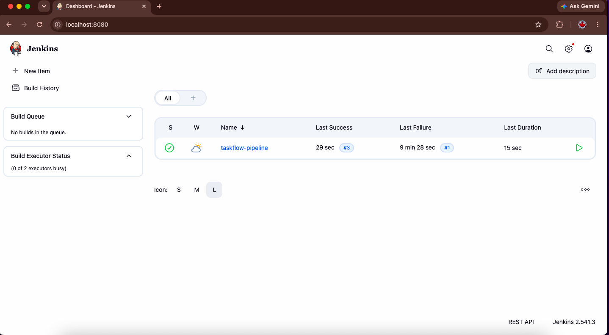

### Build history across multiple days

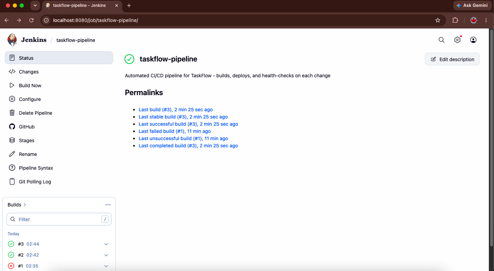

## Testing

40 automated tests covering input validation and HTTP route behavior. Tests run on every pipeline build inside an ephemeral Python container - a failing test blocks the build, the deploy, and the health check.

### Local test run

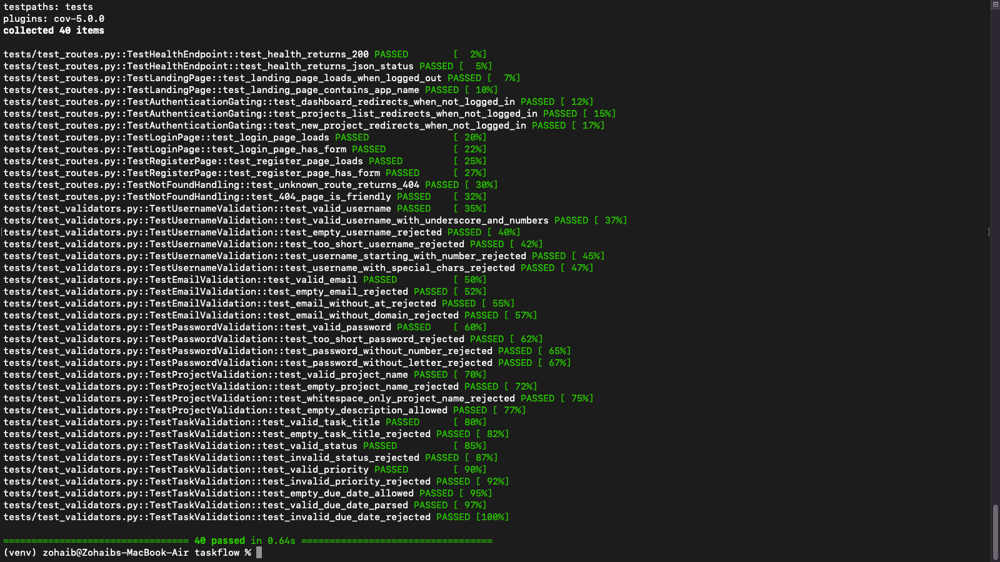

### Tests in the repository

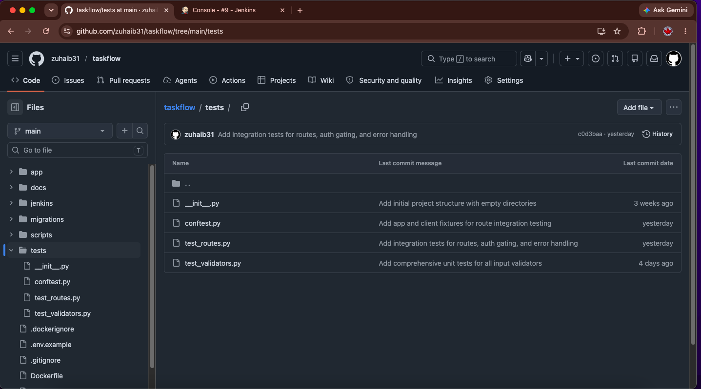

Test suite breakdown:
- `tests/test_validators.py` - 27 unit tests for username, email, password, project, task validators
- `tests/test_routes.py` - 13 integration tests for health endpoint, auth gating, route rendering, 404 handling
- `tests/conftest.py` - Pytest fixtures and dependency mocking (allows tests to run without a database)

## Quick Start

### Run the tests on any machine

```bash
git clone https://github.com/zuhaib31/taskflow.git
cd taskflow
python3 -m venv venv
source venv/bin/activate
pip install -r requirements-test.txt
pytest
```

You should see `40 passed`.

### Run the full application stack with Docker

```bash
cp .env.example .env
# Edit .env with your own secrets
docker compose up -d
```

Application available at `http://localhost:5000`.

## Full Deployment to AWS

See [`docs/DEPLOYMENT.md`](docs/DEPLOYMENT.md) for the complete step-by-step deployment procedure.

## Architecture & Design Decisions

For the full architecture explanation, design decisions, and known limitations, see [`docs/ARCHITECTURE.md`](docs/ARCHITECTURE.md).

## Project Documentation

| Document | Contents |
|----------|----------|
| [`docs/ARCHITECTURE.md`](docs/ARCHITECTURE.md) | System architecture, components, design decisions, known limitations |
| [`docs/DEPLOYMENT.md`](docs/DEPLOYMENT.md) | Step-by-step deployment guide from a fresh EC2 instance |
| [`docs/DATABASE_SCHEMA.md`](docs/DATABASE_SCHEMA.md) | Database tables, relationships, indexing |
| [`docs/LEARNINGS.md`](docs/LEARNINGS.md) | What I learned, problems I solved, honest scope statement |

## Repository Structure
taskflow/
├── app/                    # Flask application
│   ├── init.py        # Application factory
│   ├── config.py          # Environment-based configuration
│   ├── models/            # User, Project, Task models
│   ├── routes/            # Blueprints: main, auth, projects, tasks
│   ├── templates/         # Jinja2 templates
│   ├── static/css/        # Stylesheet
│   └── utils/             # Validators and decorators
├── tests/                  # pytest suite (40 tests)
├── migrations/             # SQL schema migrations
├── jenkins/                # Custom Jenkins image
│   └── Dockerfile
├── docs/                   # Architecture, deployment, learnings docs
├── screenshots/            # Portfolio screenshots
├── scripts/                # Helper scripts
├── Dockerfile              # Application container
├── docker-compose.yml      # Multi-container orchestration
├── Jenkinsfile             # CI/CD pipeline as code
├── requirements.txt        # Production dependencies
├── requirements-test.txt   # Test-only dependencies (no MySQL driver)
├── pytest.ini              # Pytest configuration
└── .env.example            # Environment variable template
## Repository Activity

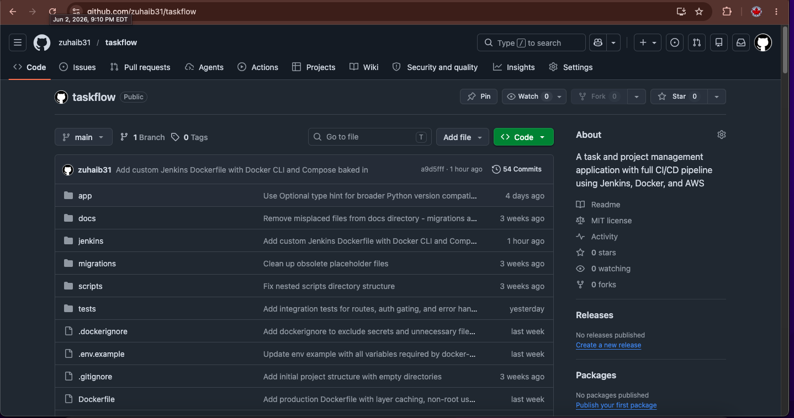

## Author

**Zohaib Ali** - Operations analyst transitioning into cloud and DevOps engineering. This project is part of my portfolio toward an entry-level cloud or DevOps role in Canada.

- GitHub: [@zuhaib31](https://github.com/zuhaib31)

## License

MIT - see [`LICENSE`](LICENSE).
